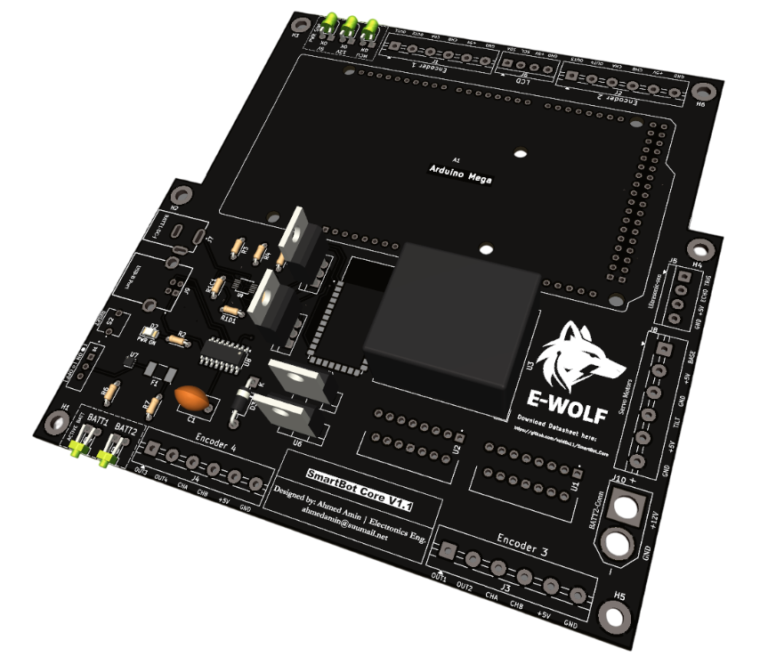
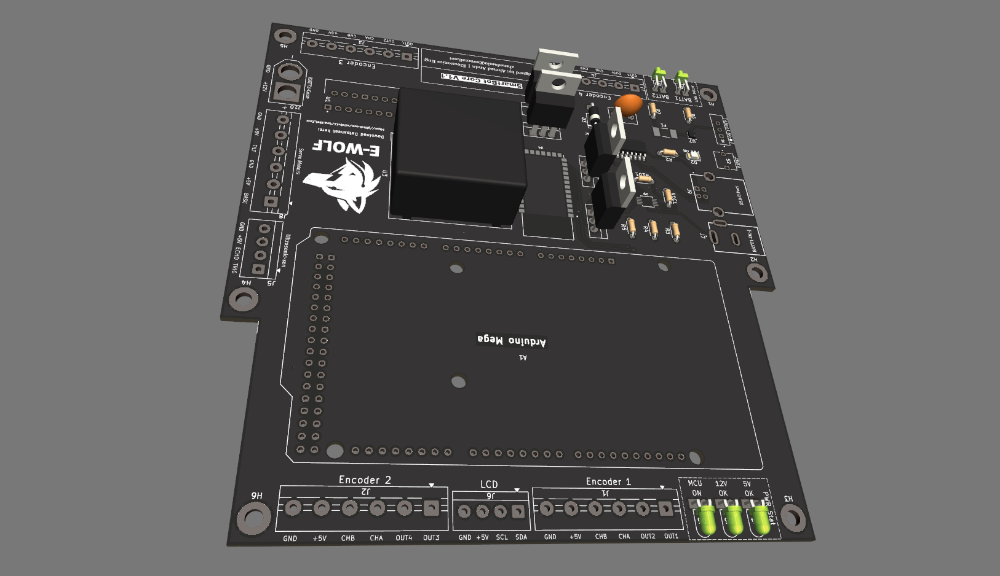
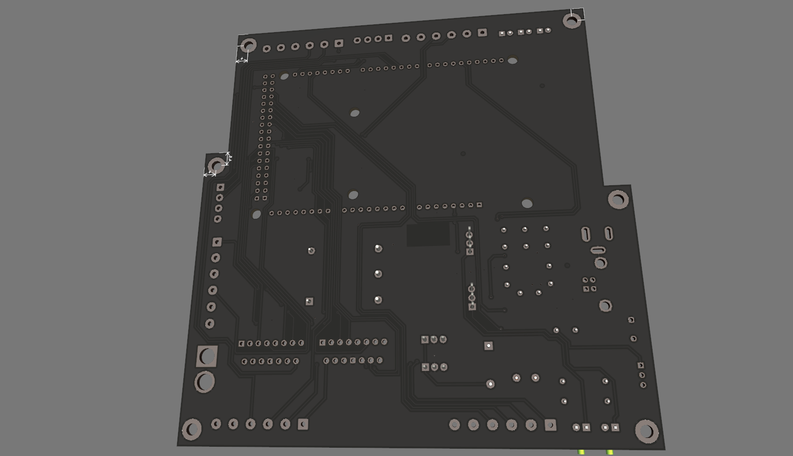
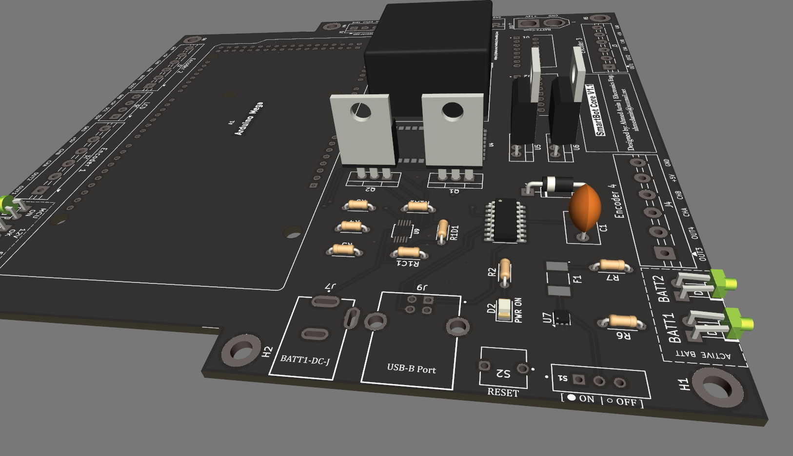
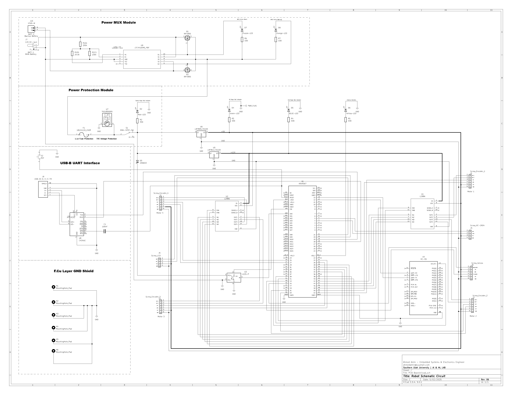
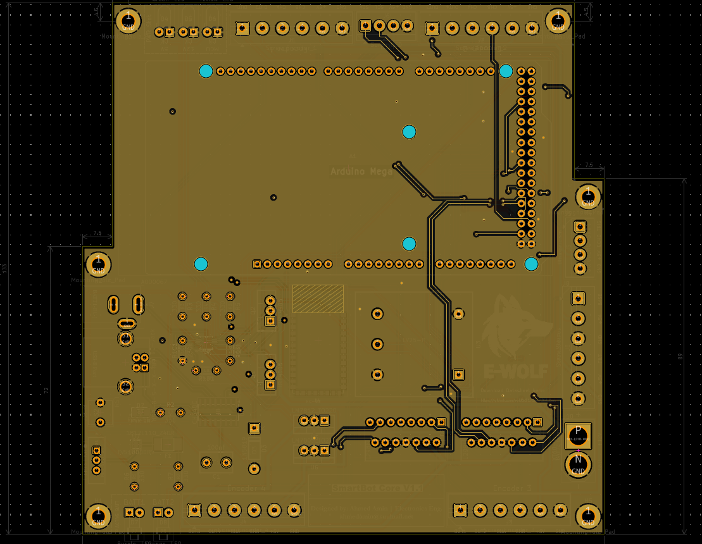
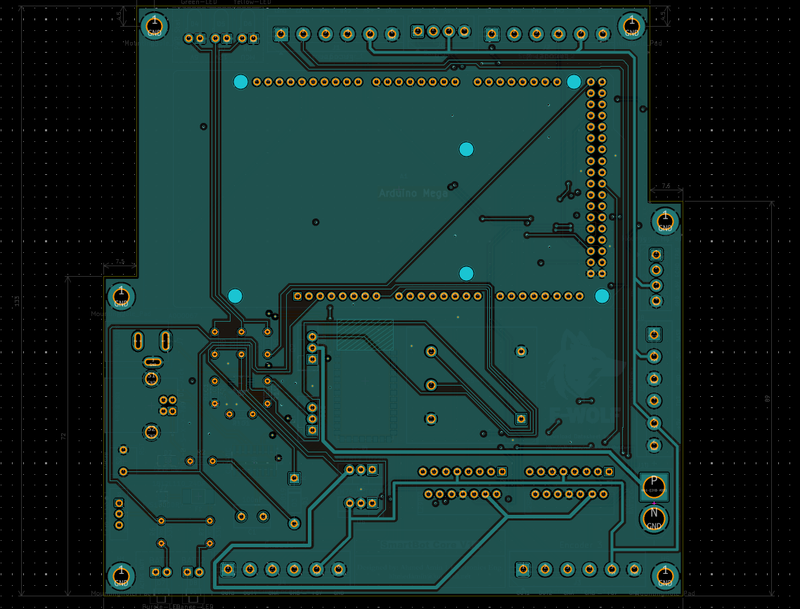
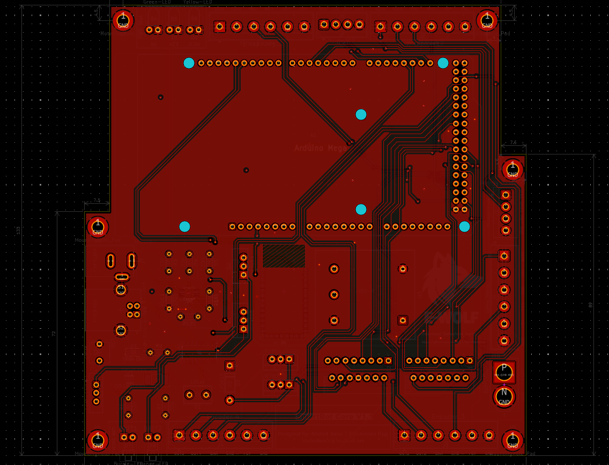

# 📦 SmartBot Core V1.1

> A professionally engineered 4-layer PCB for mobile robotics and embedded systems.

---

## 🔧 Overview

**SmartBot Core V1.1** is a custom-designed control board tailored for mobile robotics platforms.  
Built on a 4-layer FR4 stack, it combines reliable power management, motor control, encoder support, and clean communication — all in a compact, Arduino Mega-compatible footprint.

This project represents my third custom PCB design, and the first that truly feels like a product.

---

## 🧠 Core Features

### 🔋 Power That Doesn’t Quit
- Dual battery input with seamless auto-switching (Power MUX)
- Over-voltage & over-current protection (TVS diode + SMD fuse)
- BAT1 / BAT2 source indicators via onboard LEDs

### ⚙️ Motion & I/O Control
- 4 DC motor outputs via integrated L298N (w/ flyback diodes)
- 4 quadrature encoder inputs (CHA/CHB)
- Support for ultrasonic sensors, servos, and I2C LCD modules

### 🛠️ Hardware Architecture
- ATmega2560 (Arduino Mega compatible)
- USB-B interface via CH340G (UART + programming)
- 54 digital I/O, 16 analog inputs, 14 PWM channels, 10-bit ADC
- 4-layer FR4 with internal GND & Power planes
- GND stitching vias for EMI noise reduction
- Clear silkscreen labeling & breakout headers
- Onboard diagnostic LEDs for 12V, 5V, MCU, and system power

---

## 📐 Board Dimensions

- 📏 Size: 130mm × 133mm  
- 🧩 Form Factor: Arduino Mega shield compatible

---

## 🖼️ Board Gallery

---

## 🧱 Schematic & PCB Layer Stack
Schematic

Layer 1 (Surface Mount)

Layer 2 (Light Signals, GND Refrence)

Layer 3 (Power Plane)

Layer 4 (Main Traces)

---